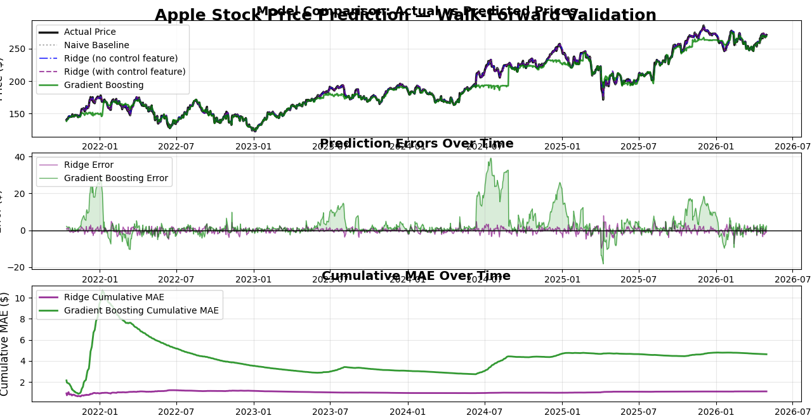

# Apple Stock Price Prediction — Walk-Forward ML Pipeline

Predicting AAPL's daily closing price using classical ML models, validated with walk-forward
(rolling-window) cross-validation instead of a single train/test split — the more realistic
way to evaluate a model on time series data.



## Why walk-forward validation

Stock prices are sequential — a random train/test split leaks future information into training,
since rows aren't independent. This project instead trains on all data up to a point in time,
tests on the next 60 days, then expands the training window forward and repeats. It's slower to
run than a single split, but it's how you'd actually validate a model meant for production use,
and it prevents the inflated accuracy you get from shuffling time series data.

## What it does

- Pulls historical OHLCV data for AAPL via `yfinance` (2010–present)
- Engineers 30+ features: lagged prices, moving averages (SMA/EMA), RSI, MACD, ATR,
  Bollinger Bands, volume ratios, and price-action spreads — all built from lagged/rolling
  values only, so there's no lookahead leakage
- Includes a random noise **control feature** to sanity-check that the models aren't just
  picking up on spurious signal (a Ridge model with vs. without this control feature is
  compared directly)
- Trains and compares 7 models per window: naive lag-1 baseline, Ridge, Lasso, ElasticNet,
  Random Forest, and Gradient Boosting
- Evaluates every model on MAE, RMSE, R², and MAPE, aggregated across all walk-forward windows
- Plots actual vs. predicted prices, per-model error over time, and cumulative MAE

## Results

Aggregated across 19 walk-forward windows (~1,140 test days, 2021–present):

| Model | MAE ($) | RMSE ($) | R² Score | MAPE (%) |
|---|---|---|---|---|
| Ridge (no control feature) | 1.10 | 1.52 | 0.9986 | 0.59 |
| Ridge (with control feature) | 1.10 | 1.52 | 0.9986 | 0.59 |
| Lasso | 1.61 | 2.26 | 0.9969 | 0.86 |
| Naive baseline | 2.33 | 3.29 | 0.9934 | 1.25 |
| Gradient Boosting | 4.61 | 8.30 | 0.9583 | 2.24 |
| Random Forest | 4.93 | 8.41 | 0.9571 | 2.43 |
| ElasticNet | 6.41 | 7.52 | 0.9657 | 3.25 |

**Best model: Ridge Regression** — MAE of $1.10, meaning predictions were off by about $1.10
on average across ~1,140 test days spanning 19 walk-forward windows. This beats the naive lag-1
baseline (predicting tomorrow's price = today's price) by roughly 53%, which matters more than
the raw R² — stock prices are highly autocorrelated day-to-day, so R² alone can look
deceptively strong even for a weak model.

The control feature (random noise) made essentially no difference to Ridge's performance
(1.1008 vs. 1.1026 MAE) — which is the expected, correct result. It confirms the pipeline isn't
picking up spurious signal from noise.

### Why tree-based models underperformed

Random Forest and Gradient Boosting did noticeably worse than the linear models here, which is a
real property of tree-based models on this kind of task rather than a tuning issue: trees split
on the *ranges* of values they saw during training and can't predict outside them. AAPL's price
trended strongly upward over the training period, so in later test windows the trees were being
asked to predict prices higher than anything in their training data — they cap out and
underestimate. Linear models don't have that limitation, which is a big part of why Ridge wins
here despite being a much simpler model.

## Project structure

```
├── apple_stock_prediction.py       # main pipeline: data, features, training, evaluation, plots
├── apple_stock_prediction_results.png  # generated chart (produced on run)
├── requirements.txt
└── README.md
```

## Setup

```bash
git clone https://github.com/siddharthhsinghh/apple-stock-price-prediction.git
cd apple-stock-price-prediction
pip install -r requirements.txt
python apple_stock_prediction.py
```

## Tech stack

Python · pandas · NumPy · scikit-learn · yfinance · Matplotlib

## What I'd improve next

- Predict **returns or price direction (up/down)** instead of raw price level — a harder but
  more meaningful task, since lag-1 price is such a dominant feature that most models look
  deceptively good just by nearly copying yesterday's close
- Replace the random control feature with real sentiment data (news headlines + VADER/FinBERT)
  to see if genuine sentiment adds signal beyond price/volume features
- Tune hyperparameters using `TimeSeriesSplit` instead of fixed values
- Add feature importance analysis (e.g., permutation importance) to see which technical
  indicators actually drive predictions across models

## License

MIT
